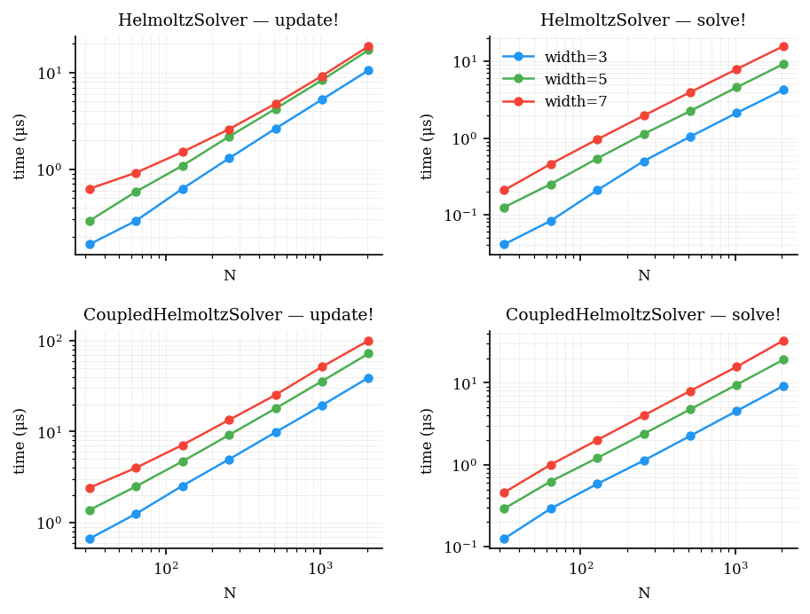

# FDHelmoltzSolver.jl

Fast in-place solvers for one-dimensional Helmholtz boundary value problems discretised with high-order banded finite-difference operators from [FDGrids.jl](https://github.com/gasagna/FDGrids.jl).

## Solvers

### `HelmoltzSolver`

Solves the scalar Helmholtz BVP with Dirichlet boundary conditions:

```
θ₀ u''(x) - θ₁ u(x) = r(x),   x ∈ [l, r]
u(l) = u_l,   u(r) = u_r
```

The system matrix `A = θ₀ D₂ - θ₁ I` is assembled and LU-factorised once per `update!` call and reused across all subsequent `solve!` calls.

### `CoupledHelmoltzSolver`

Solves a coupled two-equation BVP with four boundary conditions on `v`:

```
θ₀ u''(x) - θ₁ u(x) = r(x)
θ₂ v''(x) - θ₃ v(x) = u(x)
v(l) = v(r) = v'(l) = v'(r) = 0
```

The two Dirichlet conditions are imposed by row replacement; the two Neumann conditions are enforced via an **influence matrix** technique. The homogeneous complements `v₊`, `v₋` and the 2×2 influence matrix are precomputed in `update!` and reused across all `solve!` calls — only the particular solution is recomputed per right-hand side.

## Usage

```julia
using FDHelmoltzSolver, FDGrids, LinearAlgebra

xs = collect(range(-1, 1; length=512))
D₂ = DiffMatrix(xs, 7, 2)   # 7-point second-derivative stencil
D₁ = DiffMatrix(xs, 7, 1)   # 7-point first-derivative stencil

# ── Helmholtz solver ──────────────────────────────────────────────────────────
h = HelmoltzSolver(D₂)
update!(h, 1.0, 4.0)                  # assemble  u'' - 4u = r
r = randn(length(xs))
solve!(h, r, 0.0, 0.0)                # r overwritten with u

# ── Coupled solver ────────────────────────────────────────────────────────────
solver = CoupledHelmoltzSolver(D₂, D₁)
update!(solver, (1.0, 4.0, 1.0, 0.0)) # coefficients (θ₀, θ₁, θ₂, θ₃)
r = randn(length(xs))
solve!(solver, r)                      # r overwritten with v
```

## Performance

Both solvers are allocation-free after construction. `update!` assembles and LU-factorises in O(N·W²) time; `solve!` runs in O(N·W) time, where N is the grid size and W the stencil half-width. The system matrix coefficients are stored in the banded layout of `DiffMatrix` and factorised by the no-pivot banded LU routines in FDGrids.jl.

The figure below shows minimum wall-clock time (via BenchmarkTools) across grid sizes N = 32–2048 and stencil widths W = 3, 5, 7. Both operations scale linearly with N.


